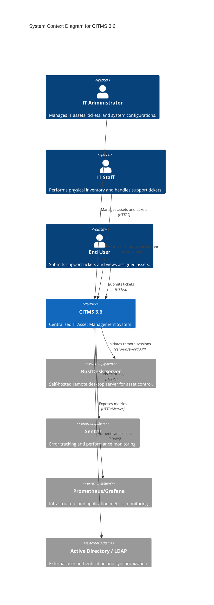
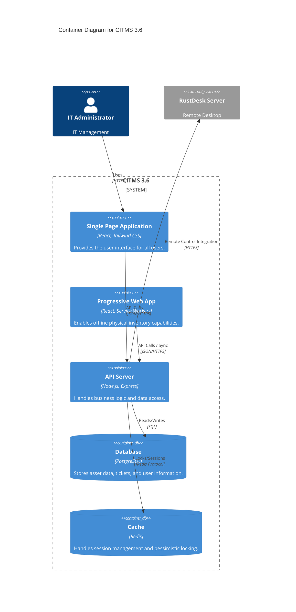
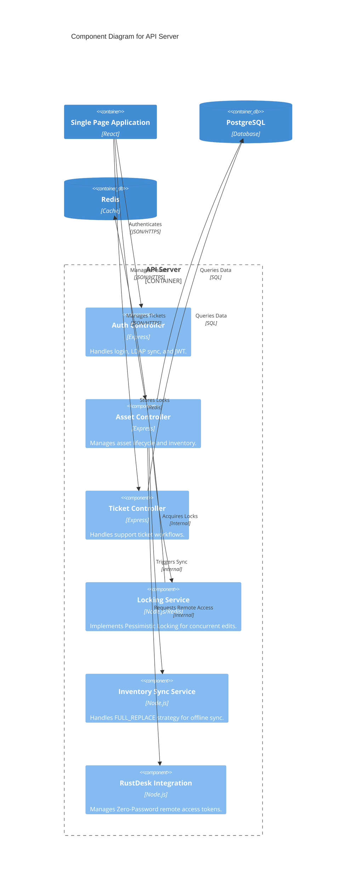

# CITMS 3.6 Architecture Documentation (C4 Model)

This document provides a high-level overview of the CITMS 3.6 (IT Asset Management System) architecture using the C4 model.

## 1. System Context Diagram

The System Context diagram shows the CITMS system and its interactions with external users and systems.

## 2. Container Diagram

The Container diagram shows the high-level technology choices and how containers communicate.

## 3. Component Diagram (API Server)

The Component diagram shows the internal structure of the API Server container.

