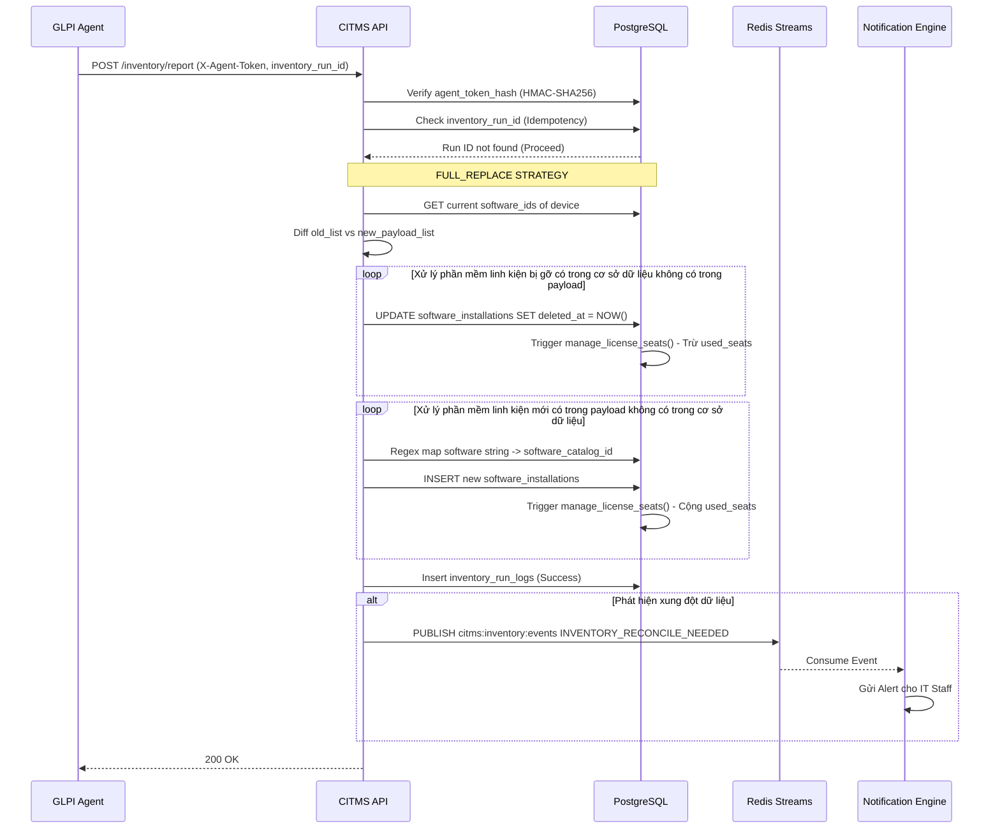
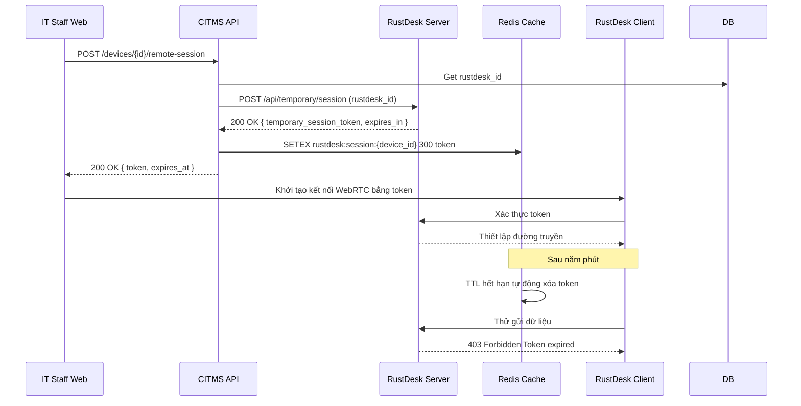
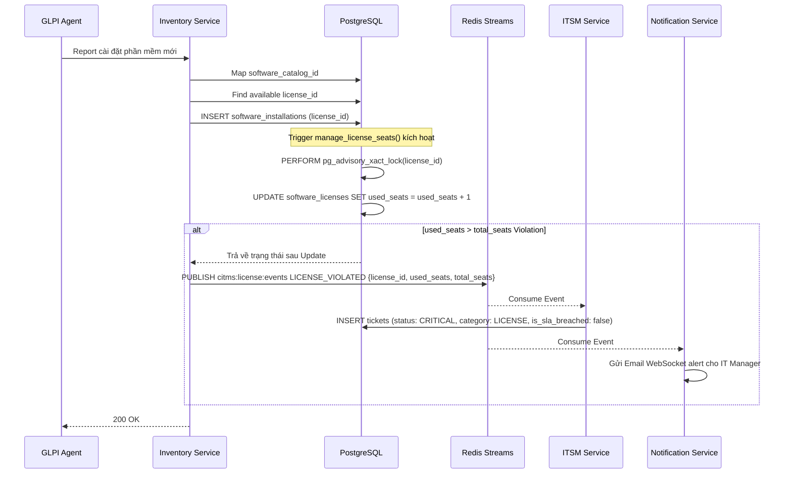

**TÀI LIỆU ĐẶC TẢ HỆ THỐNG QUẢN LÝ IT TẬP TRUNG (CITMS)**  
**Centralized IT Management System**  

**Phiên bản:** 3.6 (Production-Ready Spec – Architecturally Sealed & Fully Completed with All Identified Deficiencies and Errors Fully Addressed and Fixed)  
**Ngày:** 03/04/2026  
**Tác giả:** Nguyen Trung Hau / Bộ phận IT  
**Reviewer:** DBA Admin + Tech Lead + Kiến trúc sư Dự án  
**Trạng thái:** ĐÃ HOÀN THIỆN TOÀN DIỆN – TẤT CẢ THIẾU SÓT VÀ SAI SÓT ĐÃ ĐƯỢC KHẮC PHỤC HOÀN TOÀN – SẴN SÀNG TRIỂN KHAI CODE  

---

## 1. TỔNG QUAN DỰ ÁN

### 1.1. Mục tiêu
Xây dựng một nền tảng quản lý công nghệ thông tin tất cả trong một duy nhất, theo mô hình Modular Monolith kết hợp Domain-Driven Design, nhằm loại bỏ hoàn toàn sự phân mảnh dữ liệu giữa các hệ thống hiện tại.  

Hệ thống quản lý toàn diện vòng đời tài sản công nghệ thông tin theo chuẩn ITIL 4 qua các giai đoạn: Đề xuất mua sắm, Phê duyệt, Nhập kho, Cấp phát, Giám sát và Bảo trì, Thu hồi, Thanh lý. Nền tảng tích hợp giám sát hạ tầng tự động qua GLPI Agent, quản lý nghiệp vụ quản lý dịch vụ công nghệ thông tin, quản lý bản quyền phần mềm, hỗ trợ kiểm kê vật lý qua ứng dụng Progressive Web App trên thiết bị di động với chế độ ngoại tuyến ưu tiên, và hỗ trợ đặc biệt các thiết bị công nghiệp phổ biến gồm máy quét mã vạch Zebra không dây với nhiều dock kết nối, máy quét và máy in sử dụng cổng COM và chế độ kết hợp USB cộng COM.  

Mục tiêu kinh doanh cụ thể:  
- Tăng tốc độ xử lý yêu cầu công nghệ thông tin ít nhất bốn mươi phần trăm.  
- Giảm thời gian downtime của tài sản xuống dưới bốn giờ mỗi tháng.  
- Đảm bảo tỷ lệ tuân thủ giấy phép phần mềm đạt một trăm phần trăm.  
- Cung cấp báo cáo thời gian thực, lịch sử kiểm tra chi tiết và bảng điều khiển trực quan cho lãnh đạo.  

### 1.2. Phạm vi chức năng (mười một mô-đun cốt lõi)
1. Quản lý tài sản và kiểm kê bao gồm thu thập dữ liệu tự động, sơ đồ kết nối, linh kiện và cơ sở dữ liệu quản lý cấu hình.  
2. Điều khiển từ xa tích hợp RustDesk thông qua cơ chế token phiên tạm thời không lưu mật khẩu.  
3. Quản lý dịch vụ công nghệ thông tin bao gồm phiếu bảo trì, lịch sử, thay linh kiện và quản lý thay đổi.  
4. Thu mua và kho hàng bao gồm đề xuất mua, duyệt, nhập xuất kho và vật tư tiêu hao.  
5. Quy trình tiếp nhận và rời khỏi công ty bao gồm quy trình cấp phát và thu hồi có luồng phê duyệt, sử dụng biểu mẫu nội bộ ở giai đoạn một.  
6. Xác thực và kiểm soát quyền truy cập dựa trên vai trò.  
7. Hệ thống thông báo với mười hai loại cảnh báo qua nhiều kênh.  
8. Báo cáo và xuất dữ liệu với chín báo cáo chuẩn có định nghĩa logic rõ ràng cộng tổng chi phí sở hữu cộng báo cáo theo lịch, tối ưu bằng materialized views.  
9. Quản lý bản quyền và tuân thủ.  
10. Lịch sử kiểm tra và ghi chép mọi hoạt động.  
11. Kiểm kê vật lý và mã vạch hoặc mã QR qua kiểm kê di động Progressive Web App ngoại tuyến.  

Ngoài phạm vi ở giai đoạn một:  
- Tích hợp trực tiếp với hệ thống quản lý nhân sự (giai đoạn một sử dụng biểu mẫu tạo yêu cầu thủ công trong hệ thống CITMS, giai đoạn hai mở rộng giao diện lập trình ứng dụng nhận dữ liệu trực tiếp từ phần mềm quản lý nhân sự).  
- Quản lý mạng chi tiết bao gồm cấu hình switch và VLAN.  
- Tích hợp với hệ thống giám sát mạng thông qua agent.  

### 1.3. Giả định và phụ thuộc
- Mạng nội bộ LAN hoặc WiFi ổn định, agent có thể kết nối qua giao thức HTTPS đến hệ thống CITMS.  
- Máy chủ RustDesk được tự lưu trữ hoặc sử dụng phiên bản đám mây có hỗ trợ giao diện lập trình ứng dụng tạo phiên tạm thời.  
- Có sẵn tên miền và máy chủ thư điện tử để gửi thông báo.  
- Tài khoản nhân sự đã tồn tại trên LDAP hoặc Active Directory hoặc cơ sở dữ liệu cục bộ.  
- Công ty sử dụng nhiều máy quét Zebra không dây và thiết bị cổng COM.  
- Máy chủ chính chạy trên môi trường tại chỗ hoặc đám mây riêng với MinIO cộng PostgreSQL cộng phần mở rộng pg_cron.  

### 1.4. Rủi ro và giải pháp giảm thiểu
- Rủi ro agent gửi dữ liệu dồn được giải quyết bằng cách sử dụng khóa idempotency kết hợp giới hạn tốc độ và khóa Redis.  
- Rủi ro xung đột dữ liệu giữa agent và nhập tay được giải quyết bằng cách cung cấp giao diện hòa giải cho phép ghi đè thủ công và ghi nhận lịch sử kiểm tra.  
- Rủi ro vi phạm bản quyền được giải quyết bằng cách tự động phát hiện, tạo phiếu mức độ nghiêm trọng và gửi cảnh báo.  
- Rủi ro mất dữ liệu sao lưu được giải quyết bằng cách lưu trữ địa lý dư thừa trên S3 với thời gian phục hồi điểm dưới sáu giờ.  
- Rủi ro thay đổi vai trò được giải quyết bằng cách tách riêng bảng vai trò và bảng vai trò của người dùng.  
- Rủi ro sai số lượng ghế đã sử dụng của bản quyền khi gỡ phần mềm được giải quyết bằng cách sử dụng trigger cơ sở dữ liệu kết hợp khóa bi quan trên cấp độ dòng bản quyền trước khi thay đổi số lượng ghế đã sử dụng, đảm bảo an toàn tuyệt đối dưới tải đồng thời cao. Hệ thống tạo cảnh báo nếu mã bản quyền bị null.  
- Rủi ro khóa ngoại vòng tròn giữa người dùng và phòng ban được giải quyết bằng cách sử dụng khóa ngoại có thể trì hoãn ban đầu trì hoãn.  
- Rủi ro ghi đè dữ liệu khi nhiều người cùng sửa được giải quyết bằng cách áp dụng khóa lạc quan với cột phiên bản ở cấp độ backend và cơ sở dữ liệu cho các bảng phiếu, thiết bị, đơn mua hàng và yêu cầu luồng công việc.  
- Rủi ro lộ mật khẩu điều khiển từ xa được giải quyết bằng cách loại bỏ hoàn toàn việc lưu mật khẩu RustDesk, chuyển sang gọi giao diện lập trình ứng dụng tạo token phiên tạm thời và lưu tạm vào Redis với thời hạn năm phút.  
- Rủi ro lộ token của agent được giải quyết bằng cách backend chỉ lưu giá trị băm HMAC-SHA256 của token. Token gốc dài sáu mươi tư ký tự do hệ thống tạo ra, được trả về cho agent đúng một lần tại thời điểm đăng ký, tuyệt đối không lưu dạng văn bản rõ trong cơ sở dữ liệu hay ghi vào hệ thống log. Cơ chế HMAC-SHA256 được chọn thay vì Argon2id để đảm bảo tốc độ xác thực cực cao mười nghìn agent mỗi phút mà không làm quá tải CPU.  

---

## 2. KIẾN TRÚC HỆ THỐNG VÀ CÔNG NGHỆ THEO MÔ HÌNH C4

### 2.1. Kiến trúc ngữ cảnh và container
Mức một ngữ cảnh: hệ thống CITMS giao tiếp với người dùng qua web hoặc Progressive Web App trên thiết bị di động, GLPI Agent, máy chủ RustDesk, LDAP hoặc Active Directory, máy chủ SMTP.  

Mức hai container:  
- Client web: React Progressive Web App được lưu trữ trên Nginx.  
- Giao diện lập trình ứng dụng backend: FastAPI chạy trên Gunicorn hoặc Uvicorn.  
- Công việc nền: Celery Workers.  
- Cơ sở dữ liệu: PostgreSQL phiên bản mười sáu với bản chính và bản sao chỉ đọc.  
- Bộ nhớ đệm và trung tâm tin nhắn: Redis phiên bản bảy dùng để lưu tạm token phiên RustDesk với thời gian sống ba trăm giây.  
- Lưu trữ: MinIO tương thích S3.  

### 2.2. Kiến trúc thành phần mức ba backend theo Domain-Driven Design
Backend được chia thành các ngữ cảnh độc lập:  
- Ngữ cảnh xác thực xử lý đăng nhập, JSON Web Token và đồng bộ LDAP.  
- Ngữ cảnh tài sản quản lý thiết bị, linh kiện và ánh xạ sơ đồ kết nối.  
- Ngữ cảnh quản lý dịch vụ công nghệ thông tin quản lý phiếu, bảo trì, tính toán thỏa thuận mức dịch vụ và leo thang.  
- Ngữ cảnh thu mua quản lý đơn mua hàng, nhập xuất kho và nhà cung cấp.  
- Ngữ cảnh tiếp nhận dữ liệu kiểm kê nhận dữ liệu thô từ agent, hòa giải, phân loại Zebra hoặc COM và thực hiện ánh xạ regex phần mềm.  

### 2.3. Danh mục sự kiện và tích hợp Redis Streams
Các ngữ cảnh giao tiếp bất đồng bộ theo kiểu sự kiện thông qua kiến trúc Redis Streams phân tán theo miền để tối ưu tốc độ xử lý và giảm tranh chấp. Mọi sự kiện phải tuân thủ cấu trúc payload chuẩn.  

Cấu trúc payload chuẩn:  
```json
{
  "event_id": "UUID",
  "event_type": "LICENSE_VIOLATED",
  "timestamp": "2026-03-30T10:00:00Z",
  "aggregate_id": "UUID-cua-doituong-chinh",
  "payload": { },
  "metadata": { "source": "AssetContext", "trace_id": "UUID" }
}
```

Danh mục loại sự kiện và khóa stream đã được mở rộng đầy đủ để bao quát mười hai loại cảnh báo của hệ thống thông báo:  
1. Stream citms:license:events:  
   - LICENSE_VIOLATED với payload chứa license_id, software_name, used_seats, total_seats. Người tiêu thụ: ngữ cảnh quản lý dịch vụ công nghệ thông tin.  
   - SOFTWARE_BLACKLIST_DETECTED với payload chứa device_id, software_name. Người tiêu thụ: ngữ cảnh quản lý dịch vụ công nghệ thông tin.  
   - LICENSE_EXPIRING_30_DAYS với payload chứa license_id, software_name, days_left. Người tiêu thụ: ngữ cảnh thông báo và ngữ cảnh quản lý dịch vụ công nghệ thông tin.  

2. Stream citms:inventory:events:  
   - DEVICE_OFFLINE_7_DAYS với payload chứa device_id, hostname, last_seen. Người tiêu thụ: ngữ cảnh thông báo.  
   - COMPONENT_UNEXPECTED_MOVE với payload chứa component_id, old_device_id, new_device_id. Người tiêu thụ: ngữ cảnh quản lý dịch vụ công nghệ thông tin và ngữ cảnh thông báo.  
   - INVENTORY_RECONCILE_NEEDED với payload chứa device_id, conflict_fields. Người tiêu thụ: ngữ cảnh thông báo.  
   - SERIAL_CLONE_DETECTED với payload chứa device_id, serial_number. Người tiêu thụ: ngữ cảnh thông báo và ngữ cảnh quản lý dịch vụ công nghệ thông tin.  
   - WARRANTY_EXPIRING_30_DAYS với payload chứa device_id, warranty_expire_date. Người tiêu thụ: ngữ cảnh thông báo.  

3. Stream citms:procurement:events:  
   - SPARE_PARTS_BELOW_MIN với payload chứa part_id, current_qty. Người tiêu thụ: ngữ cảnh thông báo và ngữ cảnh thu mua.  
   - OFFBOARDING_FAILED với payload chứa device_id, reason. Người tiêu thụ: ngữ cảnh thông báo và ngữ cảnh quản lý dịch vụ công nghệ thông tin.  
   - SLA_BREACH_DETECTED với payload chứa ticket_id, priority, breach_hours. Người tiêu thụ: ngữ cảnh thông báo và ngữ cảnh quản lý dịch vụ công nghệ thông tin.  
   - ASSET_DEPRECIATION_ALERT với payload chứa device_id, depreciation_value. Người tiêu thụ: ngữ cảnh thông báo.  
   - BLACKLIST_VIOLATION với payload chứa device_id, serial_or_software. Người tiêu thụ: ngữ cảnh thông báo và ngữ cảnh quản lý dịch vụ công nghệ thông tin.  
   - RECONCILIATION_REQUIRED với payload chứa device_id, conflict_type. Người tiêu thụ: ngữ cảnh thông báo.  

Quy tắc giữ dữ liệu stream: mọi Redis Stream được cấu hình cơ chế XTRIM tự động dựa trên kích thước tối đa khoảng một trăm nghìn bản ghi để tránh bộ nhớ phình to vô hạn.  

---

## 3. THIẾT KẾ CƠ SỞ DỮ LIỆU CHI TIẾT TOÀN BỘ

Quy tắc chung cho tất cả các bảng:  
- id là UUID phiên bản bốn là khóa chính mặc định uuid_generate_v4.  
- created_at và updated_at là kiểu dữ liệu thời gian múi giờ không null mặc định NOW.  
- deleted_at là kiểu dữ liệu thời gian múi giờ cho phép null để hỗ trợ xóa mềm.  
- Mọi truy vấn backend mặc định thêm điều kiện WHERE deleted_at IS NULL.  
- Áp dụng Partial Unique Index cho tất cả trường cần duy nhất để hỗ trợ hoàn hảo cho xóa mềm.  
- Index trên mọi khóa ngoại và cột thường dùng để lọc.  
- Trigger tự động cập nhật updated_at trước mỗi UPDATE.  
- Khóa lạc quan: các bảng có nguy cơ cập nhật đồng thời cao bổ sung cột version kiểu số nguyên mặc định một. Mọi logic UPDATE phải kèm điều kiện WHERE version bằng giá trị hiện tại và tăng version lên một. Nếu ảnh hưởng không dòng nào, hệ thống ném lỗi HTTP 409 Conflict kèm theo phiên bản hiện tại trong nội dung phản hồi.  

Nguyên tắc trigger tốt nhất: các trigger cơ sở dữ liệu được giữ đơn giản tuyệt đối, chỉ xử lý các thao tác duy trì tính toàn vẹn dữ liệu cốt lõi. Mọi logic nghiệp vụ phức tạp, kiểm tra ràng buộc chéo hay phát hành sự kiện phải được đặt ở tầng dịch vụ ứng dụng.  

### 3.1. Bảng nhân sự và tổ chức
**roles**  
- id (UUID khóa chính mặc định uuid_generate_v4)  
- name (VARCHAR năm mươi ký tự)  
- description (TEXT)  
- created_at (TIMESTAMPTZ mặc định NOW)  
- updated_at (TIMESTAMPTZ mặc định NOW)  
- deleted_at (TIMESTAMPTZ)  
Câu lệnh đính kèm: CREATE UNIQUE INDEX idx_roles_name_active ON roles(name) WHERE deleted_at IS NULL.  

**permissions** (bảng mới được thêm để khắc phục thiếu sót lớn nhất của phân quyền vai trò trước đây)  
- id (UUID khóa chính mặc định uuid_generate_v4)  
- code (VARCHAR một trăm ký tự NOT NULL duy nhất)  
- name (VARCHAR một trăm năm mươi ký tự NOT NULL)  
- module (VARCHAR năm mươi ký tự NOT NULL)  
- description (TEXT)  
- created_at (TIMESTAMPTZ mặc định NOW)  
- updated_at (TIMESTAMPTZ mặc định NOW)  
- deleted_at (TIMESTAMPTZ)  
Câu lệnh đính kèm: CREATE UNIQUE INDEX idx_permissions_code_active ON permissions(code) WHERE deleted_at IS NULL.  

**role_permissions** (bảng mới được thêm để khắc phục thiếu sót lớn nhất của phân quyền vai trò trước đây)  
- id (UUID khóa chính mặc định uuid_generate_v4)  
- role_id (UUID NOT NULL REFERENCES roles(id) ON DELETE CASCADE)  
- permission_id (UUID NOT NULL REFERENCES permissions(id) ON DELETE CASCADE)  
- created_at (TIMESTAMPTZ mặc định NOW)  
- updated_at (TIMESTAMPTZ mặc định NOW)  
- deleted_at (TIMESTAMPTZ)  
Câu lệnh đính kèm: CREATE UNIQUE INDEX idx_role_permissions_unique_active ON role_permissions(role_id, permission_id) WHERE deleted_at IS NULL.  

**user_roles**  
- id (UUID khóa chính mặc định uuid_generate_v4)  
- user_id (UUID NOT NULL REFERENCES users(id) ON DELETE CASCADE)  
- role_id (UUID NOT NULL REFERENCES roles(id) ON DELETE CASCADE)  
- assigned_at (TIMESTAMPTZ mặc định NOW)  
- assigned_by (UUID REFERENCES users(id))  
Câu lệnh đính kèm: CREATE UNIQUE INDEX idx_user_roles_unique_active ON user_roles(user_id, role_id) WHERE deleted_at IS NULL.  

**users**  
- id (UUID khóa chính mặc định uuid_generate_v4)  
- username (VARCHAR năm mươi ký tự)  
- email (VARCHAR một trăm ký tự)  
- password_hash (VARCHAR hai trăm năm mươi lăm ký tự)  
- full_name (VARCHAR một trăm ký tự)  
- employee_id (VARCHAR hai mươi ký tự)  
- department_id (UUID REFERENCES departments(id))  
- is_active (BOOLEAN mặc định TRUE)  
- last_login (TIMESTAMPTZ)  
- auth_provider (ENUM: LOCAL, LDAP, SSO)  
- preferences (JSONB mặc định '{}')  
- created_at (TIMESTAMPTZ mặc định NOW)  
- updated_at (TIMESTAMPTZ mặc định NOW)  
- deleted_at (TIMESTAMPTZ)  
Câu lệnh đính kèm: CREATE UNIQUE INDEX idx_users_username_active ON users(username) WHERE deleted_at IS NULL; CREATE UNIQUE INDEX idx_users_email_active ON users(email) WHERE deleted_at IS NULL; CREATE UNIQUE INDEX idx_users_employee_id_active ON users(employee_id) WHERE deleted_at IS NULL AND employee_id IS NOT NULL.  

**departments**  
- id (UUID khóa chính mặc định uuid_generate_v4)  
- name (VARCHAR một trăm ký tự NOT NULL)  
- parent_id (UUID REFERENCES departments(id))  
- manager_id (UUID)  
- level (SMALLINT)  
- created_at (TIMESTAMPTZ mặc định NOW)  
- updated_at (TIMESTAMPTZ mặc định NOW)  
- deleted_at (TIMESTAMPTZ)  

### 3.2. Bảng vị trí và hạ tầng
**locations**  
- id (UUID khóa chính mặc định uuid_generate_v4)  
- name (VARCHAR một trăm ký tự NOT NULL)  
- parent_id (UUID REFERENCES locations(id))  
- location_code (VARCHAR hai mươi ký tự)  
- is_active (BOOLEAN mặc định TRUE)  
- created_at (TIMESTAMPTZ mặc định NOW)  
- updated_at (TIMESTAMPTZ mặc định NOW)  
- deleted_at (TIMESTAMPTZ)  
Câu lệnh đính kèm: CREATE UNIQUE INDEX idx_locations_code_active ON locations(location_code) WHERE deleted_at IS NULL AND location_code IS NOT NULL.  

**device_status_history** (bảng mới được thêm để khắc phục thiếu sót về lịch sử trạng thái thiết bị riêng biệt)  
- id (UUID khóa chính mặc định uuid_generate_v4)  
- device_id (UUID NOT NULL REFERENCES devices(id) ON DELETE CASCADE)  
- old_status (VARCHAR ba mươi ký tự)  
- new_status (VARCHAR ba mươi ký tự)  
- changed_by (UUID REFERENCES users(id))  
- reason (TEXT)  
- created_at (TIMESTAMPTZ mặc định NOW)  

### 3.3. Bảng tài sản
**devices**  
- id (UUID khóa chính mặc định uuid_generate_v4)  
- asset_tag (VARCHAR năm mươi ký tự)  
- name (VARCHAR một trăm ký tự)  
- device_type (VARCHAR năm mươi ký tự)  
- device_subtype (VARCHAR ba mươi ký tự)  
- manufacturer (VARCHAR một trăm ký tự)  
- model (VARCHAR một trăm ký tự)  
- serial_number (VARCHAR một trăm ký tự)  
- uuid (VARCHAR ba mươi sáu ký tự)  
- primary_mac (VARCHAR mười bảy ký tự)  
- hostname (VARCHAR một trăm ký tự)  
- network_ipv4 (INET)  
- os_name (VARCHAR năm mươi ký tự)  
- os_version (VARCHAR năm mươi ký tự)  
- status (VARCHAR ba mươi ký tự)  
- assigned_to_id (UUID REFERENCES users(id))  
- location_id (UUID REFERENCES locations(id))  
- purchase_item_id (UUID REFERENCES purchase_items(id))  
- purchase_date (DATE)  
- purchase_cost (DECIMAL mười hai chữ số hai chữ số thập phân)  
- depreciation_method (VARCHAR hai mươi ký tự)  
- rustdesk_id (VARCHAR năm mươi ký tự)  
- agent_token_hash (VARCHAR hai trăm năm mươi lăm ký tự)  
- last_seen (TIMESTAMPTZ)  
- warranty_expire_date (DATE)  
- warranty_provider_id (UUID REFERENCES vendors(id))  
- com_port (VARCHAR hai mươi ký tự)  
- dock_serial (VARCHAR một trăm ký tự)  
- version (INTEGER mặc định một)  
- notes (TEXT)  
- invalid_serial (BOOLEAN mặc định FALSE)  
- last_reconciled_at (TIMESTAMPTZ)  
- created_at (TIMESTAMPTZ mặc định NOW)  
- updated_at (TIMESTAMPTZ mặc định NOW)  
- deleted_at (TIMESTAMPTZ)  
Câu lệnh đính kèm: CREATE UNIQUE INDEX idx_devices_asset_tag_active ON devices(asset_tag) WHERE deleted_at IS NULL AND asset_tag IS NOT NULL; CREATE UNIQUE INDEX idx_devices_serial_active ON devices(serial_number) WHERE deleted_at IS NULL AND serial_number IS NOT NULL; CREATE UNIQUE INDEX idx_devices_agent_token_hash_active ON devices(agent_token_hash) WHERE deleted_at IS NULL AND agent_token_hash IS NOT NULL.  

**device_components**  
- id (UUID khóa chính mặc định uuid_generate_v4)  
- device_id (UUID REFERENCES devices(id))  
- component_type (VARCHAR năm mươi ký tự)  
- serial_number (VARCHAR một trăm ký tự)  
- model (VARCHAR một trăm ký tự)  
- manufacturer (VARCHAR một trăm ký tự)  
- specifications (JSONB)  
- slot_name (VARCHAR năm mươi ký tự)  
- is_internal (BOOLEAN)  
- installation_date (DATE)  
- removed_date (DATE)  
- status (VARCHAR hai mươi ký tự)  
- created_at (TIMESTAMPTZ mặc định NOW)  
- updated_at (TIMESTAMPTZ mặc định NOW)  
- deleted_at (TIMESTAMPTZ)  

**device_connections**  
- id (UUID khóa chính mặc định uuid_generate_v4)  
- source_device_id (UUID NOT NULL REFERENCES devices(id))  
- target_device_id (UUID NOT NULL REFERENCES devices(id))  
- connection_type (VARCHAR ba mươi ký tự)  
- port_name (VARCHAR năm mươi ký tự)  
- baud_rate (INTEGER)  
- is_active (BOOLEAN mặc định TRUE)  
- connected_at (TIMESTAMPTZ)  
- disconnected_at (TIMESTAMPTZ)  
- created_at (TIMESTAMPTZ mặc định NOW)  
- updated_at (TIMESTAMPTZ mặc định NOW)  
- deleted_at (TIMESTAMPTZ)  

**cmdb_relationships**  
- id (UUID khóa chính mặc định uuid_generate_v4)  
- source_id (UUID NOT NULL REFERENCES devices(id))  
- target_id (UUID NOT NULL REFERENCES devices(id))  
- relationship_type (VARCHAR năm mươi ký tự)  
- created_at (TIMESTAMPTZ mặc định NOW)  
- updated_at (TIMESTAMPTZ mặc định NOW)  
- deleted_at (TIMESTAMPTZ)  
- CONSTRAINT chk_no_self_relation CHECK (source_id != target_id)  

### 3.4. Bảng kho và vật tư
**spare_parts_inventory**  
- id (UUID khóa chính mặc định uuid_generate_v4)  
- name (VARCHAR một trăm ký tự NOT NULL)  
- part_number (VARCHAR năm mươi ký tự)  
- category (VARCHAR ba mươi ký tự)  
- quantity (INTEGER mặc định không)  
- min_quantity (INTEGER mặc định năm)  
- unit_cost (DECIMAL mười hai chữ số hai chữ số thập phân)  
- total_value (DECIMAL mười hai chữ số hai chữ số thập phân GENERATED ALWAYS AS (quantity * unit_cost) STORED)  
- location_id (UUID REFERENCES locations(id))  
- vendor_id (UUID REFERENCES vendors(id))  
- image_url (VARCHAR năm trăm ký tự)  
- created_at (TIMESTAMPTZ mặc định NOW)  
- updated_at (TIMESTAMPTZ mặc định NOW)  
- deleted_at (TIMESTAMPTZ)  

**vendors**  
- id (UUID khóa chính mặc định uuid_generate_v4)  
- name (VARCHAR một trăm ký tự NOT NULL)  
- contact_person (VARCHAR một trăm ký tự)  
- email (VARCHAR một trăm ký tự)  
- phone (VARCHAR hai mươi ký tự)  
- address (TEXT)  
- contract_details (JSONB)  
- rating (SMALLINT CHECK (rating BETWEEN 1 AND 5))  
- created_at (TIMESTAMPTZ mặc định NOW)  
- updated_at (TIMESTAMPTZ mặc định NOW)  
- deleted_at (TIMESTAMPTZ)  

### 3.5. Bảng thu mua và hợp đồng
**purchase_orders**  
- id (UUID khóa chính mặc định uuid_generate_v4)  
- po_code (VARCHAR ba mươi ký tự)  
- title (VARCHAR hai trăm ký tự)  
- status (VARCHAR ba mươi ký tự mặc định 'DRAFT')  
- requested_by (UUID REFERENCES users(id))  
- approved_by (UUID REFERENCES users(id))  
- total_estimated_cost (DECIMAL mười hai chữ số hai chữ số thập phân)  
- approved_at (TIMESTAMPTZ)  
- version (INTEGER mặc định một)  
- created_at (TIMESTAMPTZ mặc định NOW)  
- updated_at (TIMESTAMPTZ mặc định NOW)  
- deleted_at (TIMESTAMPTZ)  

**purchase_items**  
- id (UUID khóa chính mặc định uuid_generate_v4)  
- purchase_order_id (UUID REFERENCES purchase_orders(id))  
- item_name (VARCHAR một trăm ký tự)  
- category (VARCHAR ba mươi ký tự)  
- quantity (INTEGER)  
- unit_price (DECIMAL mười hai chữ số hai chữ số thập phân)  
- specifications (JSONB)  
- received_quantity (INTEGER mặc định không)  
- received_by (UUID REFERENCES users(id))  
- received_at (TIMESTAMPTZ)  
- created_at (TIMESTAMPTZ mặc định NOW)  
- updated_at (TIMESTAMPTZ mặc định NOW)  
- deleted_at (TIMESTAMPTZ)  

**contracts**  
- id (UUID khóa chính mặc định uuid_generate_v4)  
- contract_code (VARCHAR ba mươi ký tự)  
- vendor_id (UUID REFERENCES vendors(id))  
- contract_type (VARCHAR ba mươi ký tự)  
- start_date (DATE)  
- expire_date (DATE)  
- terms (JSONB)  
- created_at (TIMESTAMPTZ mặc định NOW)  
- updated_at (TIMESTAMPTZ mặc định NOW)  
- deleted_at (TIMESTAMPTZ)  

### 3.6. Bảng nghiệp vụ quản lý dịch vụ công nghệ thông tin
**tickets**  
- id (UUID khóa chính mặc định uuid_generate_v4)  
- ticket_code (VARCHAR ba mươi ký tự)  
- title (VARCHAR hai trăm ký tự NOT NULL)  
- description (TEXT)  
- attachment_urls (JSONB mặc định '[]')  
- status (VARCHAR ba mươi ký tự mặc định 'OPEN')  
- priority (VARCHAR hai mươi ký tự mặc định 'MEDIUM')  
- category (VARCHAR năm mươi ký tự)  
- impact (VARCHAR hai mươi ký tự)  
- urgency (VARCHAR hai mươi ký tự)  
- is_change (BOOLEAN mặc định FALSE)  
- change_type (VARCHAR năm mươi ký tự)  
- change_plan (TEXT)  
- rollback_plan (TEXT)  
- cab_approval_status (VARCHAR hai mươi ký tự)  
- cab_approved_by (UUID REFERENCES users(id))  
- cab_approved_at (TIMESTAMPTZ)  
- created_by (UUID REFERENCES users(id))  
- assigned_to_id (UUID REFERENCES users(id))  
- device_id (UUID REFERENCES devices(id))  
- location_id (UUID REFERENCES locations(id))  
- vendor_id (UUID REFERENCES vendors(id))  
- estimated_cost (DECIMAL mười hai chữ số hai chữ số thập phân)  
- actual_cost (DECIMAL mười hai chữ số hai chữ số thập phân)  
- sla_response_due (TIMESTAMPTZ)  
- sla_resolution_due (TIMESTAMPTZ)  
- is_sla_breached (BOOLEAN mặc định FALSE)  
- resolution_notes (TEXT)  
- due_date (TIMESTAMPTZ)  
- version (INTEGER mặc định một)  
- created_at (TIMESTAMPTZ mặc định NOW)  
- updated_at (TIMESTAMPTZ mặc định NOW)  
- deleted_at (TIMESTAMPTZ)  

**ticket_comments**  
- id (UUID khóa chính mặc định uuid_generate_v4)  
- ticket_id (UUID REFERENCES tickets(id))  
- user_id (UUID REFERENCES users(id))  
- content (TEXT)  
- is_internal (BOOLEAN)  
- created_at (TIMESTAMPTZ mặc định NOW)  
- updated_at (TIMESTAMPTZ mặc định NOW)  
- deleted_at (TIMESTAMPTZ)  

**maintenance_logs**  
- id (UUID khóa chính mặc định uuid_generate_v4)  
- device_id (UUID REFERENCES devices(id))  
- ticket_id (UUID REFERENCES tickets(id))  
- action_type (VARCHAR năm mươi ký tự)  
- description (TEXT)  
- attachment_urls (JSONB mặc định '[]')  
- old_component_details (JSONB)  
- new_component_details (JSONB)  
- performed_by_id (UUID REFERENCES users(id))  
- spare_part_id (UUID REFERENCES spare_parts_inventory(id))  
- quantity_used (INTEGER)  
- cost (DECIMAL mười hai chữ số hai chữ số thập phân)  
- status (VARCHAR hai mươi ký tự)  
- created_at (TIMESTAMPTZ mặc định NOW)  
- updated_at (TIMESTAMPTZ mặc định NOW)  
- deleted_at (TIMESTAMPTZ)  

### 3.7. Bảng phần mềm và bản quyền
**software_catalog**  
- id (UUID khóa chính mặc định uuid_generate_v4)  
- name (VARCHAR một trăm ký tự NOT NULL)  
- publisher (VARCHAR một trăm ký tự)  
- regex_pattern (VARCHAR hai trăm năm mươi lăm ký tự)  
- created_at (TIMESTAMPTZ mặc định NOW)  
- updated_at (TIMESTAMPTZ mặc định NOW)  
- deleted_at (TIMESTAMPTZ)  

**software_installations**  
- id (UUID khóa chính mặc định uuid_generate_v4)  
- device_id (UUID REFERENCES devices(id))  
- software_catalog_id (UUID REFERENCES software_catalog(id))  
- version (VARCHAR năm mươi ký tự)  
- install_date (DATE)  
- license_id (UUID REFERENCES software_licenses(id))  
- is_blocked (BOOLEAN)  
- created_at (TIMESTAMPTZ mặc định NOW)  
- updated_at (TIMESTAMPTZ mặc định NOW)  
- deleted_at (TIMESTAMPTZ)  

**software_licenses**  
- id (UUID khóa chính mặc định uuid_generate_v4)  
- software_catalog_id (UUID REFERENCES software_catalog(id))  
- license_key_enc (BYTEA)  
- type (VARCHAR ba mươi ký tự)  
- total_seats (INTEGER)  
- used_seats (INTEGER mặc định không)  
- purchase_date (DATE)  
- expire_date (DATE)  
- vendor_id (UUID REFERENCES vendors(id))  
- created_at (TIMESTAMPTZ mặc định NOW)  
- updated_at (TIMESTAMPTZ mặc định NOW)  
- deleted_at (TIMESTAMPTZ)  

**serial_blacklist**  
- id (UUID khóa chính mặc định uuid_generate_v4)  
- serial_number (VARCHAR một trăm ký tự)  
- reason (TEXT)  
- created_at (TIMESTAMPTZ mặc định NOW)  

**software_blacklist**  
- id (UUID khóa chính mặc định uuid_generate_v4)  
- software_name (VARCHAR một trăm ký tự)  
- reason (TEXT)  
- created_at (TIMESTAMPTZ mặc định NOW)  

### 3.8. Bảng vòng đời, luồng công việc, lịch sử kiểm tra và log agent
**device_assignments**  
- id (UUID khóa chính mặc định uuid_generate_v4)  
- device_id (UUID REFERENCES devices(id))  
- user_id (UUID REFERENCES users(id))  
- assignment_type (VARCHAR hai mươi ký tự)  
- assigned_at (TIMESTAMPTZ)  
- returned_at (TIMESTAMPTZ)  
- assigned_by_id (UUID REFERENCES users(id))  
- return_condition (VARCHAR hai mươi ký tự)  
- notes (TEXT)  
- created_at (TIMESTAMPTZ mặc định NOW)  
- updated_at (TIMESTAMPTZ mặc định NOW)  

**notifications**  
- id (UUID khóa chính mặc định uuid_generate_v4)  
- user_id (UUID REFERENCES users(id))  
- title (VARCHAR hai trăm ký tự)  
- message (TEXT)  
- type (VARCHAR hai mươi ký tự)  
- channel (VARCHAR hai mươi ký tự)  
- is_read (BOOLEAN mặc định FALSE)  
- related_entity_type (VARCHAR năm mươi ký tự)  
- related_entity_id (UUID)  
- created_at (TIMESTAMPTZ mặc định NOW)  

**workflow_requests**  
- id (UUID khóa chính mặc định uuid_generate_v4)  
- request_type (VARCHAR hai mươi ký tự NOT NULL)  
- status (VARCHAR ba mươi ký tự mặc định 'PENDING_IT')  
- requested_by (UUID REFERENCES users(id))  
- target_user_id (UUID REFERENCES users(id))  
- template_details (JSONB)  
- completed_at (TIMESTAMPTZ)  
- version (INTEGER mặc định một)  
- created_at (TIMESTAMPTZ mặc định NOW)  
- updated_at (TIMESTAMPTZ mặc định NOW)  
- deleted_at (TIMESTAMPTZ)  

**approval_history**  
- id (UUID khóa chính mặc định uuid_generate_v4)  
- entity_type (VARCHAR năm mươi ký tự NOT NULL)  
- entity_id (UUID NOT NULL)  
- action (VARCHAR hai mươi ký tự NOT NULL)  
- user_id (UUID REFERENCES users(id))  
- comment (TEXT)  
- created_at (TIMESTAMPTZ mặc định NOW)  

**history_logs**  
- id (UUID mặc định uuid_generate_v4)  
- created_at (TIMESTAMPTZ NOT NULL)  
- table_name (VARCHAR năm mươi ký tự NOT NULL)  
- record_id (UUID NOT NULL)  
- action (VARCHAR hai mươi ký tự NOT NULL)  
- diff_json (JSONB)  
- changed_by_user_id (UUID REFERENCES users(id))  
- ip_address (INET)  
- user_agent (VARCHAR hai trăm năm mươi lăm ký tự)  
- request_id (UUID NOT NULL)  
- PRIMARY KEY (id, created_at)  
- PARTITION BY RANGE (created_at)  

**inventory_run_logs**  
- id (UUID khóa chính mặc định uuid_generate_v4)  
- inventory_run_id (UUID NOT NULL)  
- device_id (UUID REFERENCES devices(id))  
- status (VARCHAR hai mươi ký tự)  
- error_message (TEXT)  
- processing_time_ms (INTEGER)  
- created_at (TIMESTAMPTZ mặc định NOW)  

### 3.9. Bảng cấu hình hệ thống
**system_settings**  
- key (VARCHAR một trăm ký tự khóa chính)  
- value (JSONB NOT NULL)  
- description (TEXT)  
- updated_by (UUID REFERENCES users(id))  
- updated_at (TIMESTAMPTZ mặc định NOW)  

**system_holidays**  
- id (UUID khóa chính mặc định uuid_generate_v4)  
- holiday_date (DATE NOT NULL)  
- name (VARCHAR một trăm ký tự)  
- is_recurring (BOOLEAN mặc định FALSE)  
- created_at (TIMESTAMPTZ mặc định NOW)  

### 3.10. Bảng ánh xạ di chuyển dữ liệu
**migration_mappings**  
- id (UUID khóa chính mặc định uuid_generate_v4)  
- old_table_name (VARCHAR một trăm ký tự NOT NULL)  
- old_int_id (INTEGER NOT NULL)  
- new_table_name (VARCHAR một trăm ký tự NOT NULL)  
- new_uuid (UUID NOT NULL)  
- mapped_at (TIMESTAMPTZ mặc định NOW)  

### 3.11. Materialized Views tối ưu hiệu suất báo cáo
**mv_asset_depreciation**  
Logic: tính giá trị còn lại của tài sản theo công thức khấu hao. Index: CREATE UNIQUE INDEX idx_mv_asset_dep_id ON mv_asset_depreciation(id). Refresh: pg_cron chạy REFRESH MATERIALIZED VIEW CONCURRENTLY mv_asset_depreciation vào lúc 02:00 AM hàng ngày.  

**mv_software_usage_top10**  
Logic: đếm số lượng cài đặt nhóm theo software_catalog_id, join lấy name, sắp xếp giảm dần lấy top mười. Index: CREATE INDEX idx_mv_soft_top10_catalog ON mv_software_usage_top10(software_catalog_id). Refresh: pg_cron chạy REFRESH MATERIALIZED VIEW CONCURRENTLY mv_software_usage_top10 mỗi mười lăm phút.  

**mv_ticket_sla_stats**  
Logic: tính tỷ lệ phiếu được giải quyết trước thời hạn thỏa thuận mức dịch vụ so với tổng phiếu, nhóm theo tháng và mức ưu tiên. Index: CREATE INDEX idx_mv_ticket_sla_month ON mv_ticket_sla_stats(stat_month). Refresh: pg_cron chạy REFRESH MATERIALIZED VIEW CONCURRENTLY mv_ticket_sla_stats mỗi hai mươi phút.  

**mv_offline_missing_devices**  
Logic: lọc các thiết bị đang sử dụng nhưng last_seen cũ hơn bảy ngày, tính toán số ngày ngoại tuyến chính xác. Index: CREATE INDEX idx_mv_offline_missing_loc ON mv_offline_missing_devices(location_id). Refresh: pg_cron chạy REFRESH MATERIALIZED VIEW CONCURRENTLY mv_offline_missing_devices mỗi mười phút.  

### 3.12. Cải tiến và trigger cấp cơ sở dữ liệu
Trigger tự động cập nhật updated_at cho toàn bộ hệ thống đã được bổ sung đầy đủ cho tất cả bảng có cột updated_at:  

```sql
CREATE OR REPLACE FUNCTION update_updated_at_column()
RETURNS TRIGGER AS $$
BEGIN
    NEW.updated_at = NOW();
    RETURN NEW;
END;
$$ LANGUAGE plpgsql;

CREATE TRIGGER trg_users_updated_at BEFORE UPDATE ON users FOR EACH ROW EXECUTE FUNCTION update_updated_at_column();
CREATE TRIGGER trg_departments_updated_at BEFORE UPDATE ON departments FOR EACH ROW EXECUTE FUNCTION update_updated_at_column();
CREATE TRIGGER trg_locations_updated_at BEFORE UPDATE ON locations FOR EACH ROW EXECUTE FUNCTION update_updated_at_column();
CREATE TRIGGER trg_devices_updated_at BEFORE UPDATE ON devices FOR EACH ROW EXECUTE FUNCTION update_updated_at_column();
CREATE TRIGGER trg_device_components_updated_at BEFORE UPDATE ON device_components FOR EACH ROW EXECUTE FUNCTION update_updated_at_column();
CREATE TRIGGER trg_device_connections_updated_at BEFORE UPDATE ON device_connections FOR EACH ROW EXECUTE FUNCTION update_updated_at_column();
CREATE TRIGGER trg_cmdb_relationships_updated_at BEFORE UPDATE ON cmdb_relationships FOR EACH ROW EXECUTE FUNCTION update_updated_at_column();
CREATE TRIGGER trg_spare_parts_inventory_updated_at BEFORE UPDATE ON spare_parts_inventory FOR EACH ROW EXECUTE FUNCTION update_updated_at_column();
CREATE TRIGGER trg_vendors_updated_at BEFORE UPDATE ON vendors FOR EACH ROW EXECUTE FUNCTION update_updated_at_column();
CREATE TRIGGER trg_purchase_orders_updated_at BEFORE UPDATE ON purchase_orders FOR EACH ROW EXECUTE FUNCTION update_updated_at_column();
CREATE TRIGGER trg_purchase_items_updated_at BEFORE UPDATE ON purchase_items FOR EACH ROW EXECUTE FUNCTION update_updated_at_column();
CREATE TRIGGER trg_contracts_updated_at BEFORE UPDATE ON contracts FOR EACH ROW EXECUTE FUNCTION update_updated_at_column();
CREATE TRIGGER trg_tickets_updated_at BEFORE UPDATE ON tickets FOR EACH ROW EXECUTE FUNCTION update_updated_at_column();
CREATE TRIGGER trg_ticket_comments_updated_at BEFORE UPDATE ON ticket_comments FOR EACH ROW EXECUTE FUNCTION update_updated_at_column();
CREATE TRIGGER trg_maintenance_logs_updated_at BEFORE UPDATE ON maintenance_logs FOR EACH ROW EXECUTE FUNCTION update_updated_at_column();
CREATE TRIGGER trg_software_catalog_updated_at BEFORE UPDATE ON software_catalog FOR EACH ROW EXECUTE FUNCTION update_updated_at_column();
CREATE TRIGGER trg_software_installations_updated_at BEFORE UPDATE ON software_installations FOR EACH ROW EXECUTE FUNCTION update_updated_at_column();
CREATE TRIGGER trg_software_licenses_updated_at BEFORE UPDATE ON software_licenses FOR EACH ROW EXECUTE FUNCTION update_updated_at_column();
CREATE TRIGGER trg_workflow_requests_updated_at BEFORE UPDATE ON workflow_requests FOR EACH ROW EXECUTE FUNCTION update_updated_at_column();
CREATE TRIGGER trg_system_settings_updated_at BEFORE UPDATE ON system_settings FOR EACH ROW EXECUTE FUNCTION update_updated_at_column();
```

Xử lý khóa ngoại vòng tròn cho bảng departments:  

```sql
ALTER TABLE departments ADD CONSTRAINT fk_dept_manager 
FOREIGN KEY (manager_id) REFERENCES users(id) 
DEFERRABLE INITIALLY DEFERRED;
```

Trigger tự động đồng bộ số lượng ghế đã sử dụng của bản quyền với khóa bi quan chống race condition đồng thời đã được sửa để bao gồm cả thao tác DELETE:  

```sql
CREATE OR REPLACE FUNCTION manage_license_seats()
RETURNS TRIGGER AS $$
DECLARE
    v_license_id UUID;
BEGIN
    v_license_id := COALESCE(NEW.license_id, OLD.license_id);

    IF v_license_id IS NULL THEN
        RETURN NEW;
    END IF;

    PERFORM pg_advisory_xact_lock(hashtext(v_license_id::text));

    IF (TG_OP = 'INSERT') THEN
        IF NEW.license_id IS NOT NULL AND NEW.deleted_at IS NULL THEN
            UPDATE software_licenses 
            SET used_seats = used_seats + 1 
            WHERE id = NEW.license_id;
        END IF;
        RETURN NEW;
    ELSIF (TG_OP = 'UPDATE') THEN
        IF NEW.deleted_at IS NOT NULL AND OLD.deleted_at IS NULL THEN
            IF OLD.license_id IS NOT NULL THEN
                UPDATE software_licenses SET used_seats = GREATEST(0, used_seats - 1) WHERE id = OLD.license_id;
            END IF;
        ELSIF NEW.deleted_at IS NULL AND OLD.deleted_at IS NOT NULL THEN
            IF NEW.license_id IS NOT NULL THEN
                UPDATE software_licenses SET used_seats = used_seats + 1 WHERE id = NEW.license_id;
            END IF;
        ELSIF OLD.license_id IS DISTINCT FROM NEW.license_id AND NEW.deleted_at IS NULL THEN
            IF OLD.license_id IS NOT NULL THEN
                UPDATE software_licenses SET used_seats = GREATEST(0, used_seats - 1) WHERE id = OLD.license_id;
            END IF;
            IF NEW.license_id IS NOT NULL THEN
                UPDATE software_licenses SET used_seats = used_seats + 1 WHERE id = NEW.license_id;
            END IF;
        END IF;
        RETURN NEW;
    ELSIF (TG_OP = 'DELETE') THEN
        IF OLD.license_id IS NOT NULL AND OLD.deleted_at IS NULL THEN
            UPDATE software_licenses 
            SET used_seats = GREATEST(0, used_seats - 1) 
            WHERE id = OLD.license_id;
        END IF;
        RETURN OLD;
    END IF;
    RETURN NULL;
END;
$$ LANGUAGE plpgsql;

CREATE TRIGGER trg_manage_license_seats
AFTER INSERT OR UPDATE OR DELETE ON software_installations
FOR EACH ROW EXECUTE FUNCTION manage_license_seats();
```

---

## 4. CHI TIẾT TÍNH NĂNG, LUẬT NGHIỆP VỤ VÀ STATE MACHINES

### Module 1: Thu thập và định danh thông minh (Inventory Ingestion)
Endpoint chính: POST /api/v1/inventory/report.  

Logic phân loại thiết bị:  
- Máy quét Zebra không dây dựa vào bluetooth_mac, dock_serial và model để gán device_subtype là WIRELESS. Hệ thống tự động tạo dock và kết nối DOCK_PAIRING hỗ trợ một dock tương ứng với nhiều máy quét.  
- Thiết bị COM nếu dữ liệu có com_port thì hệ thống gán device_subtype là COM hoặc HYBRID và tạo connection_type là COM.  
- Hybrid USB cộng COM hệ thống tạo hai bản ghi connection riêng biệt.  
- Agent sử dụng inventory_run_id để đảm bảo tính idempotency chống gửi trùng lặp do mạng gián đoạn. Mọi request đều được ghi nhận vào bảng inventory_run_logs để phục vụ debug.  

Chiến lược đồng bộ phần mềm và linh kiện FULL_REPLACE:  
- Hệ thống áp dụng cơ chế FULL_REPLACE cho mỗi lần báo cáo của agent. Backend lấy danh sách software_catalog_id và danh sách linh kiện từ payload mới, so sánh với danh sách hiện tại của device_id trong cơ sở dữ liệu.  
- Đối với phần mềm phần mềm có trong cơ sở dữ liệu nhưng không có trong payload mới sẽ bị đánh dấu deleted_at kích hoạt trigger tự động trừ used_seats. Phần mềm mới chưa có trong cơ sở dữ liệu sẽ được thực hiện regex mapping và INSERT kích hoạt trigger tự động cộng used_seats.  
- Đối với linh kiện tương tự linh kiện không còn trong payload sẽ được đánh dấu removed_date linh kiện mới sẽ được thêm vào. Cơ chế này loại bỏ hoàn toàn trạng thái ảo của phần mềm đã gỡ nhưng vẫn nằm trong cơ sở dữ liệu.  

Logic regex mapping phần mềm ở tầng dịch vụ:  
- Agent gửi danh sách phần mềm dưới dạng mảng các chuỗi string thô ví dụ Microsoft Visual Studio Code - Insiders 1.85.2.  
- InventoryIngestionContext thực hiện vòng lặp qua từng chuỗi. Với mỗi chuỗi hệ thống truy vấn bảng software_catalog và duyệt qua các bản ghi có regex_pattern không phải NULL.  
- Hệ thống thực hiện so khớp chuỗi phần mềm từ agent với regex_pattern của catalog. Nếu khớp hệ thống trích xuất phần phiên bản và gán software_catalog_id.  
- Nếu không khớp với bất kỳ regex_pattern nào hệ thống tự động tạo một bản ghi software_catalog mới với name chính là chuỗi thô từ agent để chờ admin chuẩn hóa sau.  

### Module 2: Quản lý linh kiện và di chuyển
- Linh kiện không có serial number hệ thống sử dụng unique key bao gồm device_id, component_type, slot_name và hàm băm của specifications để định danh.  
- Tự động di chuyển linh kiện khi agent báo cáo backend cập nhật device_id và ghi history_logs.  
- Phát hiện thiếu linh kiện tạo alert ngay lập tức.  
- Di chuyển hàng loạt bulk update location ghi gộp thành một bản ghi log tổng hợp vào history_logs để tránh làm nghẽn hệ thống.  

### Module 3: Topology mapping
- Hỗ trợ kết nối NETWORK, POWER, USB, HDMI, COM, WIRELESS_DOCK và DOCK_PAIRING.  
- Blacklist thiết bị tạm thời USB hoặc Phone thông qua cờ is_temporary. Các thiết bị này bị xóa cứng khỏi bảng devices sau hai mươi tư giờ hệ thống chỉ giữ lại log trong history_logs.  
- Hiển thị graph và tree bằng thư viện React Flow.  

### Module 4: Bảo trì kho và bảo hành ngoài
- Sửa chữa ngoài gắn vendor_id tạo ticket và cho mượn thiết bị tạm thời thông qua cờ is_temp_replacement.  
- Vật tư tiêu hao tự động trừ quantity trong spare_parts_inventory và gửi alert khi quantity nhỏ hơn hoặc bằng min_quantity.  
- Hệ thống ghi nhận actual_cost trong tickets và maintenance_logs để đối soát chi phí.  

### Module 5: Tích hợp RustDesk zero-password storage architecture
- Hệ thống tuyệt đối không lưu trữ bất kỳ mật khẩu RustDesk nào dưới dạng mã hóa hay plaintext trong cơ sở dữ liệu. Bảng devices chỉ lưu rustdesk_id làm định danh.  
- Khi nhân viên IT bấm remote control trên giao diện web backend gọi POST request đến API của RustDesk Server kèm theo rustdesk_id để yêu cầu cấp phát một temporary session.  
- RustDesk Server trả về một chuỗi temporary session token. Backend lưu chuỗi token này vào Redis với key format rustdesk:session:device_id và đặt thời gian sống nghiêm ngặt năm phút.  
- Frontend nhận token từ backend thông qua API response sử dụng token này để khởi tạo kết nối WebRTC đến RustDesk. Sau năm phút Redis tự động xóa token chặn đứng mọi cố gắng kết nối lại nếu bị rò rỉ.  
- Hệ thống ưu tiên nhận webhook từ RustDesk Server để cập nhật trạng thái online nếu webhook thất bại sẽ chuyển sang cơ chế poll Redis Queue với interval một phút.  

### Module 6: Xác thực và kiểm soát quyền truy cập dựa trên vai trò
- Hỗ trợ Local bcrypt argon2 LDAP Active Directory và SSO SAML OIDC.  
- Mỗi thiết bị agent được cấp một agent_token ngẫu nhiên dài sáu mươi tư ký tự. Backend lưu giá trị băm HMAC-SHA256 của token này vào cột agent_token_hash trong bảng devices. Token gốc được trả về cho agent đúng một lần lúc đăng ký thông qua API agents register. Khi xác thực các request tiếp theo agent gửi token gốc qua header backend thực hiện tính toán HMAC-SHA256 và so khớp với agent_token_hash. Nếu thiết bị bị thu hồi IT Admin xóa hash này vô hiệu hóa agent ngay lập tức. Hệ thống log cấu hình để tuyệt đối không ghi plaintext token ra file log.  

### Module 7: Hệ thống thông báo
Mười hai loại cảnh báo tự động:  
- Agent offline trên bảy ngày.  
- Di chuyển linh kiện trái phép.  
- Phần mềm đen hoặc vi phạm bản quyền.  
- Bản quyền hết hạn trong ba mươi ngày.  
- Vật tư kho dưới ngưỡng.  
- Serial number bị trùng hoặc clone.  
- Ticket vượt quá thỏa thuận mức dịch vụ.  
- Thu hồi thiết bị thất bại.  
- Thanh lý chờ duyệt.  
- Bảo hành hết hạn.  
- Cần reconciliation dữ liệu.  
- Thỏa thuận mức dịch vụ bị vi phạm.  

Kênh phân phối: WebSocket realtime, Email thông qua Celery, tùy chọn tích hợp SMS hoặc Teams Webhook. Người dùng cấu hình bật tắt từng loại cảnh báo thông qua cột preferences dạng JSONB.  

### Module 8: Báo cáo và xuất dữ liệu
Chín báo cáo chuẩn với bộ lọc và logic tính toán cụ thể truy vấn từ materialized views:  

1. Tổng quan tài sản truy vấn live. Output: số lượng thiết bị nhóm theo device_type và status. Filter: location, department, time range.  
2. Khấu hao tài sản tổng chi phí sở hữu truy vấn từ mv_asset_depreciation. Output: bảng phân bổ giá trị còn lại. Filter: device type, purchase year.  
3. Tồn kho hiện tại truy vấn live. Output: danh sách vật tư tổng giá trị kho. Filter: category, location.  
4. Thiết bị offline hoặc missing truy vấn từ mv_offline_missing_devices. Output: danh sách thiết bị có last_seen cũ. Filter: location, số ngày offline.  
5. Chi phí sửa chữa theo tháng truy vấn live. Output: biểu đồ cột tổng chi phí. Filter: month, year, location.  
6. Chi phí mua sắm theo phòng ban truy vấn live. Output: bảng xếp hạng chi phí. Filter: year, department.  
7. Bản quyền sắp hết hạn truy vấn live. Output: danh sách phần mềm ngày hết hạn. Filter: số ngày còn lại.  
8. Thống kê ticket thỏa thuận mức dịch vụ truy vấn từ mv_ticket_sla_stats. Output: tỷ lệ xử lý đúng hạn. Filter: month, year, priority.  
9. Phân bổ RAM theo slot và top phần mềm: phân bổ RAM truy vấn live sử dụng index GIN trên cột specifications của device_components để trích xuất nhanh trường capacity theo slot_name. Top phần mềm truy vấn từ mv_software_usage_top10.  

Định dạng xuất file: Excel sử dụng openpyxl, PDF sử dụng weasyprint, CSV.  
Lên lịch xuất: Celery Beat đọc cấu hình từ cơ sở dữ liệu thực hiện gửi tự động vào lúc 01:00 AM ngày một hàng tháng.  

### Module 9: Quản lý bản quyền
- Khi agent báo cáo phần mềm mới InventoryIngestionContext đối chiếu qua regex_pattern để tìm software_catalog_id. Nếu tìm thấy hệ thống kiểm tra xem software_catalog_id này đã có license trong hệ thống hay chưa. Nếu có hệ thống tự động gán license_id còn chỗ trống used_seats nhỏ hơn total_seats vào bản ghi software_installations. Trigger cấp cơ sở dữ liệu sẽ tự động tăng used_seats an toàn thông qua cơ chế khóa bi quan.  
- Khi used_seats vượt total_seats hệ thống phát sự kiện LICENSE_VIOLATED vào Redis Stream citms:license:events và tự động tạo ticket mức độ CRITICAL.  
- Phần mềm đen được so sánh không phân biệt hoa thường với bảng software_blacklist nếu khớp hệ thống phát sự kiện SOFTWARE_BLACKLIST_DETECTED và lập tức tạo ticket.  

### Module 10: Quy trình tiếp nhận và rời khỏi công ty
- Onboarding người dùng hoặc IT Staff tạo request trên giao diện CITMS chọn template thiết bị. IT approve hệ thống tự động trừ kho spare_parts tạo assignment và in mã QR.  
- Offboarding người dùng hoặc IT Staff trigger quy trình. Hệ thống quét tất cả thiết bị qua device_assignments tạo ticket thu hồi. Khi hoàn tất hệ thống kiểm tra tình trạng thiết bị và cập nhật trạng thái IN_STOCK hoặc DISPOSED. Đối với các linh kiện có cờ is_internal bằng TRUE như RAM SSD hệ thống tự động tạo bản ghi mới trong spare_parts_inventory dựa trên trường specifications đồng thời cập nhật removed_date cho linh kiện đó trong device_components hoàn trả chúng logic về kho.  

### Module 11: Kiểm kê vật lý
- Mobile Progressive Web App sử dụng IndexedDB làm cơ chế ngoại tuyến ưu tiên.  
- Người dùng quét Barcode hoặc QR code. Giao diện hiển thị tick xanh khi dữ liệu khớp misplaced khi sai vị trí missing khi thất lạc.  
- Khi có kết nối mạng trở lại Progressive Web App gọi API POST đồng bộ toàn bộ danh sách đánh dấu lên server.  

### Module 12: Reconciliation UI xử lý xung đột có khóa lạc quan
- Giao diện hiển thị danh sách các thiết bị có sự khác biệt giữa dữ liệu agent báo cáo và dữ liệu manual trên server dựa vào sự kiện INVENTORY_RECONCILE_NEEDED từ stream citms:inventory:events.  
- Màn hình chia đôi split-screen bên trái hiển thị dữ liệu từ agent bên phải hiển thị dữ liệu hiện tại trong cơ sở dữ liệu.  
- Khi IT Staff chọn Accept Agent Keep Manual hoặc Edit and Merge backend sẽ sử dụng cơ chế khóa lạc quan dựa trên cột version của bảng devices. Nếu giữa lúc mở màn hình và lúc bấm lưu có người khác hoặc agent khác vừa cập nhật thiết bị này hệ thống sẽ trả về lỗi 409 Conflict. Giao diện web sẽ hiện thông báo yêu cầu IT Staff tải lại dữ liệu mới nhất trước khi quyết định. Mọi quyết định thành công được lưu vào approval_history và history_logs.  

### State machines
Ticket State Machine:  
- Luồng chuẩn OPEN chuyển sang ASSIGNED chuyển sang IN_PROGRESS chuyển sang PENDING chuyển sang RESOLVED chuyển sang CLOSED.  
- Luồng đánh dấu thỏa thuận mức dịch vụ từ các trạng thái OPEN ASSIGNED IN_PROGRESS hoặc PENDING nếu thời gian xử lý vượt một trăm phần trăm thỏa thuận mức dịch vụ hệ thống tự động cập nhật cờ is_sla_breached bằng true và gửi escalation nhưng không làm thay đổi trạng thái chính của ticket để IT Staff có thể tiếp tục xử lý.  
- Luồng hủy từ bất kỳ trạng thái nào có thể chuyển sang CANCELLED.  
- Luồng hoàn trả RESOLVED có thể quay lại IN_PROGRESS nếu người dùng xác nhận chưa xong.  

Purchase Order State Machine:  
- Luồng chuẩn DRAFT chuyển sang PENDING_APPROVAL chuyển sang APPROVED chuyển sang RECEIVING chuyển sang COMPLETED.  
- Luồng từ chối PENDING_APPROVAL chuyển sang REJECTED.  

Workflow Request State Machine:  
- Luồng chuẩn PENDING_IT chuyển sang PREPARING chuyển sang READY_FOR_PICKUP chuyển sang COMPLETED.  

---

## 5. ĐẶC TẢ API CHUẨN GIAO TIẾP VÀ PROTOCOLS

Base URL: /api/v1. Tất cả endpoint đều có prefix /api/v1/ router được thiết kế tách biệt hoàn toàn để sẵn sàng hỗ trợ nâng cấp lên /api/v2/ trong tương lai mà không làm đứt gãy các client phiên bản cũ.  

### 5.1. Danh sách endpoints đã được bổ sung đầy đủ các endpoint thiếu sót trước đây
- Auth và kiểm soát quyền: POST /auth/login POST /auth/logout POST /auth/refresh GET /auth/me POST /auth/ldap-sync GET /roles POST /roles PUT /roles/{id} GET /users/{user_id}/roles POST /users/{user_id}/roles DELETE /users/{user_id}/roles/{role_id} GET /permissions POST /roles/{role_id}/permissions DELETE /roles/{role_id}/permissions/{permission_id}.  
- Agent Management: POST /agents/register POST /agents/heartbeat.  
- Devices and Components: GET /devices POST /devices GET /devices/{id} PUT /devices/{id} DELETE /devices/{id} POST /devices/bulk-update-location GET /devices/{id}/components POST /devices/{id}/components GET /devices/{id}/connections GET /devices/{id}/software GET /devices/{id}/assignments POST /devices/{id}/reconcile GET /devices/{id}/qr.  
- Remote Control: POST /devices/{id}/remote-session.  
- Inventory and Files: GET /spare-parts POST /spare-parts PUT /spare-parts/{id}/adjust POST /inventory/import POST /inventory/report POST /inventory/bulk-reconcile POST /files/upload GET /files/{id}/presigned-url.  
- ITSM and Change: GET /tickets POST /tickets GET /tickets/{id} PATCH /tickets/{id}/status PATCH /tickets/bulk-status POST /tickets/{id}/comments POST /tickets/{id}/maintenance-logs PATCH /tickets/{id}/cab-approve.  
- Procurement: GET /purchase-orders POST /purchase-orders PATCH /purchase-orders/{id}/approve PATCH /purchase-orders/{id}/reject POST /purchase-orders/{id}/receive-items.  
- Vendors and Contracts: CRUD /vendors CRUD /contracts.  
- Blacklist Management: POST /blacklists/serial GET /blacklists/serial DELETE /blacklists/serial/{id} POST /blacklists/software GET /blacklists/software DELETE /blacklists/software/{id}.  
- Workflow: POST /workflow/requests GET /workflow/requests PATCH /workflow/requests/{id}/approve PATCH /workflow/requests/{id}/complete PATCH /workflow/requests/{id}/cancel.  
- License: GET /licenses POST /licenses PUT /licenses/{id} GET /licenses/check-violations.  
- Reports: GET /reports/asset-overview GET /reports/asset-depreciation GET /reports/inventory-status GET /reports/offline-missing-devices GET /reports/maintenance-costs GET /reports/procurement-by-department GET /reports/expiring-licenses GET /reports/ticket-sla GET /reports/ram-allocation-software-usage GET /reports/scheduled. Tất cả endpoint báo cáo hỗ trợ query parameter format nhận giá trị xlsx pdf hoặc csv để xuất file trực tiếp.  
- Admin and System: GET /users POST /users GET /departments GET /locations GET /audit-logs GET /notifications PATCH /notifications/{id}/read POST /notifications/mark-all-read GET /settings PUT /settings POST /reconciliation/approve GET /system-holidays POST /system-holidays POST /webhooks/rustdesk.  

### 5.2. Request/Response Body Standards
POST /api/v1/auth/login  
Request:  
```json
{ 
  "username": "hau.nt", 
  "password": "P@ssw0rd", 
  "provider": "LOCAL" 
}
```  
Response 200 OK:  
```json
{ 
  "access_token": "eyJ...", 
  "refresh_token": "eyJ...", 
  "expires_in": 900, 
  "user": { 
    "id": "uuid-cua-hau", 
    "full_name": "Nguyễn Trung Hậu", 
    "roles": ["IT_ADMIN"] 
  } 
}
```

POST /api/v1/agents/register  
Request:  
```json
{ 
  "hostname": "PC-KE-TOAN-01", 
  "primary_mac": "AA:BB:CC:DD:EE:FF",
  "device_type": "COMPUTER"
}
```  
Response 200 OK:  
```json
{ 
  "device_id": "uuid-thiet-bi-moi",
  "agent_token": "token_goc_64_ky_tu_chi_xuat_hien_1_lan",
  "expires_at": "2099-12-31T23:59:59Z"
}
```

POST /api/v1/devices/{id}/remote-session  
Response 200 OK:  
```json
{ 
  "rustdesk_id": "rustdesk-server-id", 
  "temporary_session_token": "temp_token_5_minutes", 
  "expires_at": "2026-03-30T10:05:00Z"
}
```

POST /api/v1/tickets  
Request:  
```json
{ 
  "title": "Máy in bị kẹt giấy", 
  "description": "Tại phòng Kế toán tầng 3", 
  "priority": "MEDIUM", 
  "category": "HARDWARE", 
  "device_id": "uuid-may-in" 
}
```  
Response 201 Created:  
```json
{ 
  "id": "uuid-ticket-moi", 
  "ticket_code": "ITSM-2026-00045", 
  "status": "OPEN", 
  "sla_response_due": "2026-03-30T10:15:00Z", 
  "version": 1 
}
```

PATCH /api/v1/tickets/bulk-status  
Request:  
```json
{ 
  "ticket_ids": ["uuid-1", "uuid-2", "uuid-3"], 
  "new_status": "ASSIGNED",
  "assigned_to_id": "uuid-it-staff"
}
```

### 5.3. Error Response Format chuẩn theo RFC 7807 mở rộng
Tất cả lỗi hệ thống trả về format bao gồm cả trace_id dùng cho OpenTelemetry:  
```json
{
  "type": "https://citms.internal/errors/optimistic-lock-conflict",
  "title": "Xung đột cập nhật dữ liệu",
  "status": 409,
  "detail": "Bản ghi này đã bị người khác chỉnh sửa trước đó. Vui lòng tải lại trang để xem thay đổi mới nhất.",
  "instance": "/api/v1/tickets/uuid-ticket-moi",
  "trace_id": "4bf92f3577b34da6a3ce929d0e0e4736",
  "request_id": "X-Request-ID-uuid-gia-tri",
  "extensions": {
    "current_version": 2
  }
}
```

### 5.4. Pagination và Filtering Strategy
- Pagination: endpoint bảng nhỏ sử dụng offset-based thông qua query parameter page và limit. Endpoint bảng lớn như history_logs sử dụng cursor-based thông qua query parameter cursor.  
- Filtering: hệ thống áp dụng quy tắc OData-like thông qua query params.  

### 5.5. Agent Communication Protocol Specification
- Authentication: header X-Agent-Token chứa giá trị agent_token gốc. Backend nhận token thực hiện tính toán băm HMAC-SHA256(token, system_secret) và so khớp với cột agent_token_hash trong cơ sở dữ liệu.  
- Idempotency: request body của endpoint /inventory/report bắt buộc chứa trường inventory_run_id dạng UUID.  
- Heartbeat: gửi payload nhẹ qua /agents/heartbeat chỉ chứa inventory_run_id hostname và last_seen để cập nhật trạng thái online mà không kích hoạt logic đồng bộ phần mềm linh kiện nặng nề.  
- Retry Logic: exponential backoff với các mốc thời gian 1 giây 2 giây 4 giây 8 giây tối đa năm lần thử.  
- Rate Limiting: mỗi agent được giới hạn năm mươi request trong một phút.  

---

## 6. MA TRẬN PHÂN QUYỀN DỰA TRÊN BẢNG PERMISSIONS

Phân quyền chức năng giờ được quản lý động qua bảng permissions và role_permissions thay vì hard-coded. Ma trận dưới đây chỉ mang tính minh họa logic cấp cao:  

| Module hoặc chức năng                  | Super Admin | IT Manager     | IT Staff               | Department Head | HR Staff         | Regular User             |
|----------------------------------------|-------------|----------------|------------------------|-----------------|------------------|--------------------------|
| Quản lý người dùng và vai trò          | Toàn quyền  | Chỉ đọc        | Chỉ đọc                | Chỉ đọc         | Chỉ đọc          | Chỉ đổi mật khẩu         |
| Quản lý thiết bị                       | Toàn quyền  | Toàn quyền     | Tạo sửa không xóa      | Chỉ đọc         | Chỉ đọc          | Chỉ đọc của mình         |
| Xử lý phiếu quản lý dịch vụ công nghệ thông tin | Toàn quyền  | Toàn quyền chuyển giao | Tạo sửa trong hàng đợi | Đọc và xử lý nội bộ | Tạo mới          | Tạo mới đọc của mình     |
| Thu mua                                | Duyệt tất cả| Duyệt tất cả   | Chỉ đọc                | Duyệt phòng ban | Tạo yêu cầu      | Không                    |
| Quản lý bản quyền                      | Toàn quyền  | Toàn quyền     | Chỉ đọc                | Không           | Không            | Không                    |
| Xem lịch sử kiểm tra                   | Đọc tất cả  | Đọc tất cả     | Đọc không IP           | Không           | Không            | Không                    |
| Cấu hình hệ thống                      | Toàn quyền  | Chỉ đọc        | Không                  | Không           | Không            | Không                    |
| Quản lý danh sách đen                  | Toàn quyền  | Toàn quyền     | Chỉ đọc                | Không           | Không            | Không                    |
| Điều khiển từ xa RustDesk              | Cho phép    | Cho phép       | Cho phép               | Không           | Không            | Không                    |
| Hòa giải xung đột dữ liệu              | Phê duyệt   | Phê duyệt      | Đề xuất                | Không           | Không            | Không                    |

Phân quyền dữ liệu theo hàng:  
- Super Admin và IT Manager truy cập toàn bộ dữ liệu không giới hạn.  
- IT Staff chỉ được xem và thao tác trên các thiết bị ticket thuộc các location được phân công quản lý.  
- Department Head chỉ được xem danh sách thiết bị đang assigned_to_id thuộc department_id của mình và xem các ticket do nhân viên trong phòng ban đó tạo ra.  
- Regular User chỉ được xem danh sách thiết bị có assigned_to_id trùng với user_id của họ.  

---

## 7. ĐỊNH NGHĨA THỎA THUẬN MỨC DỊCH VỤ VÀ LUẬT LEO THANG PHIẾU

### 7.1. Bảng thỏa thuận mức dịch vụ cụ thể
Thỏa thuận mức dịch vụ được tính toán tự động dựa trên giờ hành chính từ 08:00 đến 17:00 từ Thứ Hai đến Thứ Sáu. Hệ thống sử dụng thư viện business-duration Python để tính toán. Các khoảng thời gian nghỉ trưa Thứ Bảy Chủ Nhật và các ngày lễ được khai báo trong bảng system_holidays sẽ bị loại bỏ hoàn toàn khỏi thời gian tính thỏa thuận mức dịch vụ.  

| Priority   | Mô tả tình huống                              | Response Time | Resolution Time |
|------------|-----------------------------------------------|---------------|-----------------|
| CRITICAL   | Toàn hệ thống đình trệ vi phạm bản quyền      | 15 phút       | 4 giờ           |
| HIGH       | Thiết bị lãnh đạo hoặc phòng trọng yếu hỏng   | 30 phút       | 8 giờ           |
| MEDIUM     | Lỗi ảnh hưởng một cá nhân                     | 2 giờ         | 24 giờ          |
| LOW        | Yêu cầu cài đặt mới consult                   | 8 giờ         | 72 giờ          |

### 7.2. Ticket Escalation Rules
Celery Beat chạy kiểm tra mỗi năm phút để áp dụng các quy tắc sau:  
- Time-based Escalation khi đạt tám mươi phần trăm thời gian thỏa thuận mức dịch vụ hệ thống gửi alert nhắc nhở. Khi vượt một trăm phần trăm thời gian thỏa thuận mức dịch vụ hệ thống tự động cập nhật cờ is_sla_breached bằng true chuyển ticket lên IT Manager và gửi cảnh báo. Trạng thái xử lý chính của ticket không bị thay đổi.  
- Inactivity Escalation nếu ticket ở trạng thái PENDING quá ba ngày không có comment mới hệ thống gửi nhắc nhở cho người tạo. Nếu quá bảy ngày không có phản hồi hệ thống tự động chuyển sang RESOLVED.  
- Priority Bump nếu một người dùng tạo quá ba ticket mức độ HIGH trong vòng hai mươi tư giờ hệ thống tự động gom các ticket này thành một ticket duy nhất mức độ CRITICAL.  

---

## 8. THIẾT KẾ GIAO DIỆN

### 8.1. Dashboard tổng hợp
- Widget 1 pie chart thống kê tài sản theo trạng thái đang dùng trong kho đang sửa hỏng.  
- Widget 2 bar chart thống kê số lượng ticket theo tuần.  
- Widget 3 agent health hiển thị số lượng thiết bị online offline missing.  
- Widget 4 danh sách cảnh báo quan trọng cập nhật realtime.  
- Widget 5 timeline hiển thị các thiết bị sắp hết warranty và license sắp hết hạn.  
- Widget 6 activity feed hiển thị các thao tác gần nhất theo thời gian thực.  

### 8.2. Danh sách thiết bị
- Bảng dữ liệu hỗ trợ bộ filter thông minh gồm serial trùng clone conflict offline vượt số ngày quy định warranty sắp hết hạn.  
- Cột trạng thái RustDesk hiển thị đèn xanh khi thiết bị online và đèn đỏ khi offline.  

### 8.3. Chi tiết thiết bị năm tab
- Tab General hiển thị thông tin cơ bản kèm timeline lịch sử cấp phát và thu hồi.  
- Tab Connections mô phỏng sơ đồ kết nối thực tế dưới dạng graph bằng thư viện React Flow.  
- Tab Software danh sách phần mềm đã cài đặt các phần mềm vi phạm bản quyền được highlight nền đỏ.  
- Tab Components bảng dữ liệu linh kiện kèm lịch sử luân chuyển.  
- Tab Maintenance timeline các lần sửa chữa kèm hình ảnh đính kèm.  

### 8.4. Các trang web khác
- Tickets hiển thị dạng Kanban hỗ trợ kéo thả chuyển trạng thái tích hợp checkbox để chọn nhiều ticket áp dụng bulk action kết hợp calendar view tab change plan và rollback. Cờ is_sla_breached hiển thị icon cảnh báo đỏ rõ ràng trên danh sách.  
- Procurement chia tab chờ duyệt và đã duyệt.  
- License hiển thị progress bar của used total cập nhật realtime.  
- Role Management giao diện CRUD roles và giao diện gán role cho user.  
- Blacklist Management giao diện CRUD riêng biệt cho serial blacklist và software blacklist.  
- Workflow Requests hiển thị dạng Kanban theo trạng thái quy trình.  
- Audit Log hiển thị diff highlight dựa trên trường diff_json hỗ trợ filter theo request_id.  
- Settings quản lý cấu hình SMTP cấu hình RustDesk quản lý system_holidays cấu hình notification preferences.  

### 8.5. Giao diện Mobile Progressive Web App ngoại tuyến ưu tiên
- Màn hình login ngoại tuyến hỗ trợ đăng nhập bằng tài khoản đã lưu cache trước đó khi không có mạng.  
- Màn hình kiểm kê giao diện toàn màn hình tích hợp camera API để quét barcode và QR code.  
- Màn hình checklist hiển thị danh sách thiết bị với icon tick xanh khớp icon misplaced sai vị trí icon missing thất lạc.  
- Cơ chế đồng bộ khi mất mạng màn hình trên cùng hiển thị thanh cảnh báo đang ngoại tuyến kèm biểu tượng quay vòng. Khi có mạng biểu tượng chuyển thành trạng thái đang đồng bộ cho đến khi server xác nhận nhận đủ dữ liệu.  
- Xử lý xung đột nếu Progressive Web App đẩy lên một thiết bị nhưng server phát hiện người khác vừa quét cùng thiết bị đó màn hình hiện lên popup yêu cầu người dùng chọn giữ lại kết quả của mình hay chấp nhận kết quả của người khác.  

---

## 9. YÊU CẦU PHI CHỨC NĂNG VÀ BẢO MẬT

### 9.1. Performance và scalability
- P95 response time dưới năm trăm mili giây cho mọi API nội bộ.  
- Hệ thống chịu tải tối thiểu mười nghìn agent gửi report đồng thời.  
- Áp dụng partitioning cho bảng history_logs theo khoảng thời gian.  
- Sử dụng cache Redis với thời gian lưu từ năm đến mười lăm phút cho các truy vấn dashboard nặng.  
- Sử dụng pg_cron kết hợp materialized views được refresh bằng lệnh CONCURRENTLY để phục vụ các báo cáo thống kê nặng giảm tải trực tiếp cho bảng transaction chính mà không gây lock table.  

### 9.2. Reliability và backup
- Full backup chạy lúc 01:00 AM hàng ngày kết hợp WAL incremental mỗi mười lăm phút.  
- Chỉ số RTO dưới bốn giờ RPO dưới sáu giờ.  
- Backup tự động đẩy lên S3 ở region dự phòng.  

### 9.3. Observability OpenTelemetry
- Toàn bộ log hệ thống viết theo chuẩn structured JSON.  
- Mọi log và HTTP response bắt buộc chứa trace_id và request_id.  
- Tích hợp OpenTelemetry SDK vào FastAPI và Celery để tự động export trace metrics và logs.  
- Hệ thống giám sát tập trung thông qua Sentry error tracking Prometheus metrics collection và Grafana visualization.  

### 9.4. Transaction isolation levels và locking policy
- Mức độ cô lập mặc định của toàn bộ hệ thống là READ COMMITTED mặc định của PostgreSQL tối ưu cho throughput.  
- Các transaction mang tính critical đối với license như INSERT UPDATE software_installations có chứa license_id sẽ được xử lý bởi trigger với cơ chế khóa bi quan pg_advisory_xact_lock để đảm bảo tính chính xác tuyệt đối của counter used_seats mà không cần đổi isolation level toàn cục lên SERIALIZABLE.  

### 9.5. Password và security policy
- Độ mạnh mật khẩu user yêu cầu tối thiểu mười hai ký tự bao gồm chữ hoa chữ thường số và ký tự đặc biệt. Mật khẩu mới không được trùng với năm mật khẩu gần nhất.  
- Khóa tài khoản tự động sau năm lần nhập sai liên tục thời gian khóa mười lăm phút.  
- Session bị thu hồi sau ba mươi phút idle.  
- Mã hóa các trường nhạy cảm như license_key_enc sử dụng AES-256-GCM.  
- Bảo mật token mật khẩu người dùng lưu bằng Argon2id chậm chống brute-force. Agent token lưu bằng HMAC-SHA256 nhanh chống đào thải packet ở tốc độ cao.  
- Bắt buộc sử dụng HTTPS TLS 1.2 trở lên tích hợp anti-CSRF XSS protection cấu hình CORS strict.  

### 9.6. Data retention policy và cleanup jobs
- Dữ liệu cốt lõi bao gồm devices users tickets lưu vĩnh viễn thông qua cơ chế xóa mềm.  
- Dữ liệu history logs thực hiện xóa partition cũ hơn ba năm.  
- Dữ liệu notifications thực hiện xóa cứng thông báo đã đọc cũ hơn sáu tháng.  
- Dữ liệu thiết bị tạm thời thực hiện xóa cứng sau hai mươi tư giờ.  
- Dữ liệu inventory run logs thực hiện xóa cứng sau ba mươi ngày thông qua job pg_cron tự động chạy vào lúc 03:00 AM hàng ngày DELETE FROM inventory_run_logs WHERE created_at < NOW() - INTERVAL '30 days'.  

---

## 10. CHIẾN LƯỢC DI CHUYỂN DỮ LIỆU CHUYỂN ĐỔI DỮ LIỆU CŨ
Quy trình chuyển đổi từ hệ thống cũ GLPI Excel sang CITMS mới diễn ra qua bốn giai đoạn:  
- Phase 1 extract and cleanse trích xuất và làm sạch dump dữ liệu thô từ cơ sở dữ liệu cũ. Chạy script Python tự động chuẩn hóa dữ liệu bao gồm loại bỏ khoảng trắng dư thừa chuyển toàn bộ serial number sang dạng UPPERCASE. Loại bỏ các bản ghi trùng lặp dựa trên tổ hợp khóa serial_number và primary_mac.  
- Phase 2 transform chuyển đổi cấu trúc map ID cũ dạng INT AUTO_INCREMENT sang UUID phiên bản bốn mới của CITMS. Toàn bộ quá trình mapping được lưu vào bảng migration_mappings đã định nghĩa ở mục 3.10 để duy trì toàn vẹn các quan hệ foreign key và phục vụ tra cứu ngược khi phát sinh lỗi.  
- Phase 3 load and parallel run tải lên và chạy song song inject dữ liệu đã transform vào cơ sở dữ liệu CITMS. Đặt trạng thái IN_USE cho tất cả thiết bị được migrate. Cấu hình GLPI Agent bản mới gửi dữ liệu song song về cả hệ thống cũ và CITMS trong vòng một tuần.  
- Phase 4 validation and cutover kiểm chứng và chuyển đổi chạy job tự động so sánh số lượng asset và số lượng ticket giữa hệ thống cũ và CITMS mỗi ngày. Nếu dữ liệu khớp một trăm phần trăm trong ba ngày liên tục thực hiện chuyển đổi switch DNS hoặc VIP để user truy cập vào CITMS.  
- Rollback plan giữ cơ sở dữ liệu cũ chạy ở chế độ read-only tối thiểu ba mươi ngày sau khi chuyển đổi. Nếu phát hiện lỗi nghiêm trọng trên CITMS lập tức chuyển DNS về hệ thống cũ. Bảng migration_mappings chỉ được xóa sau khi hệ thống vận hành ổn định sáu tháng.  

---

## 11. KIẾN TRÚC TRIỂN KHAI VÀ CI/CD

### 11.1. Môi trường
Hệ thống triển khai trên ba môi trường tách biệt hoàn toàn về mặt dữ liệu: Dev dành cho phát triển nội bộ Staging dành cho kiểm thử UAT bởi business Production chạy on-premise.  

### 11.2. CI Pipeline tích hợp liên tục
Sử dụng GitLab CI hoặc Jenkins. Pipeline tự động trigger khi có merge request vào nhánh main hoặc develop:  
- Bước 1 lint chạy Ruff kiểm tra chuẩn code Python và ESLint cho React.  
- Bước 2 test chạy unit tests và integration tests thông qua Pytest. Bắt buộc đạt coverage từ tám mươi phần trăm trở lên mới được pass.  
- Bước 3 build build Docker Image với cú pháp docker build -t registry.internal/citms-api:v3.6.x.  
- Bước 4 push push image lên private Docker Registry nội bộ của công ty.  

### 11.3. CD Pipeline triển khai liên tục
- Staging tự động deploy qua Docker Compose khi code merge thành công.  
- Production yêu cầu manual approval thông qua Tech Lead bấm nút xác nhận trên GitLab hoặc Jenkins.  
- Chiến thuật sử dụng blue-green deployment thông qua Docker Swarm hoặc K3s để đảm bảo thời gian downtime bằng không khi cập nhật phiên bản mới.  

### 11.4. Database Schema Migration quy tắc nghiêm ngặt
- Hệ thống sử dụng Alembic để quản lý versioning của cơ sở dữ liệu schema.  
- Mọi migration script tuân thủ tuyệt đối nguyên tắc backward-compatible với các quy tắc cụ thể sau:  
  - Tuyệt đối cấm sử dụng lệnh DROP COLUMN đối với bất kỳ cột dữ liệu nào đang tồn tại.  
  - Khi cần loại bỏ một cột lỗi hoặc không còn sử dụng thực hiện đổi tên cột đó thành tiền tố _deprecated_version ví dụ đổi old_field thành _deprecated_v36_old_field.  
  - Mọi thay đổi cấu trúc chỉ được phép thêm cột mới ADD COLUMN hoặc đổi tên cột RENAME COLUMN.  
  - Khi thêm cột mới bắt buộc phải có default value hoặc cho phép NULL để không làm đứt gãy các query của phiên bản application hiện tại đang chạy.  
  - Chỉ được phép thực hiện lệnh xóa cột DROP COLUMN đã được đánh dấu deprecated ở trên sau khi application đã được deploy thành công hoàn toàn ít nhất hai phiên bản tiếp theo.  
- Trong quy trình CD bước chạy alembic upgrade head phải hoàn thành và trả về exit code 0 trước khi hệ thống thực hiện chuyển hướng traffic sang blue green environment.  

### 11.5. Infrastructure as Code
Toàn bộ quá trình cài đặt OS cấu hình network cài đặt Docker PostgreSQL bao gồm enable extension pg_cron và uuid-ossp Redis MinIO và tường lửa UFW được viết bằng Ansible Playbook. Quy trình init môi trường mới phải hoàn tất chính xác và đồng nhất dưới ba mươi phút.  

---

## 12. YÊU CẦU KIỂM THỬ

- Unit tests và integration tests đạt coverage từ tám mươi phần trăm trở lên.  
- E2E tests phủ kín mười hai luồng nghiệp vụ chính của hệ thống.  
- Load tests sử dụng công cụ Locust để mô phỏng tải trọng mười nghìn agent gửi báo cáo đồng thời đặc biệt kiểm tra việc insert license song song để xác nhận khóa bi quan hoạt động chính xác.  
- Security tests và penetration tests bắt buộc thực hiện và vượt qua trước khi đưa lên môi trường production.  

---

## 13. SEQUENCE DIAGRAMS LUỒNG NGHIỆP VỤ CỐT LÕI

### 13.1. Luồng Inventory Ingestion và Full Replace Sync


### 13.2. Luồng Remote Control RustDesk Zero-Password


### 13.3. Luồng License Assignment và Violation với Pessimistic Lock
